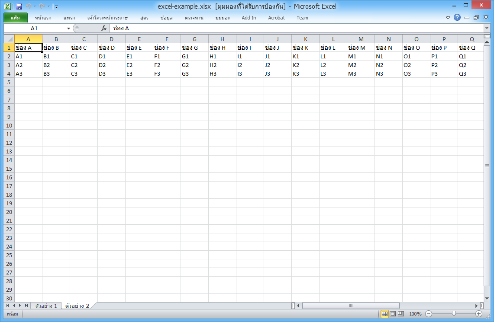

PHPExcel TH
============================================================

Version: 1.0.1

Release date: 2016-03-13

Author:	Eakkabin Jaikeawma (CoachMaxz)

------------------------------------------------------------

Install 
============================================================

```
$ composer require drivesoftz/yii2-phpexcel ~1.0
```

Example 
============================================================

```php
use PHPExcel;

$excel = new PHPExcel();

$excel->setPropertie([
  'creator'     => 'Eakakbin Jaikeawma',
  'modified'    => 'Eakakbin Jaikeawma',
  'title'       => 'PHPExcel Test Document',
  'subject'     => 'PHPExcel Test Document',
  'description' => 'Test document for PHPExcel, generated using PHP classes.',
  'keywords'    => 'office PHPExcel php',
  'category'    => 'Test result file',
]);
        
$excel->setCells([
  [
    'title' => 'ตัวอย่าง 1',
    'header' => [ 'ช่อง 1', 'ช่อง 2', 'ช่อง 3', 'ช่อง 4' ],
    'items' => [
      [ 'สวัสดีครับ A1', '', 'สวัสดีครับ C1','' ],
      [ '', 'สวัสดีครับ B2', '','สวัสดีครับ D2' ],
    ]
  ],
  [
    'title' => 'ตัวอย่าง 2',
    'header' => [ 'ช่อง A', 'ช่อง B', 'ช่อง C', 'ช่อง D', 'ช่อง E', 'ช่อง F', 'ช่อง G', 'ช่อง H', 'ช่อง I', 'ช่อง J', 'ช่อง K', 'ช่อง L', 'ช่อง M', 'ช่อง N', 'ช่อง O', 'ช่อง P', 'ช่อง Q', 'ช่อง R', 'ช่อง S', 'ช่อง T', 'ช่อง U', 'ช่อง V', 'ช่อง W', 'ช่อง X', 'ช่อง Y', 'ช่อง Z', 'ช่อง AA', ' ช่อง AB' ],
    'items' => [
        [ 'A1', 'B1', 'C1', 'D1', 'E1', 'F1' ,'G1', 'H1', 'I1', 'J1', 'K1', 'L1', 'M1', 'N1' ,'O1', 'P1', 'Q1', 'R1', 'S1', 'T1', 'U1', 'V1', 'W1', 'X1', 'Y1', 'Z1', 'AA1', 'AB1' ],
        [ 'A2', 'B2', 'C2', 'D2', 'E2', 'F2' ,'G2', 'H2', 'I2', 'J2', 'K2', 'L2', 'M2', 'N2' ,'O2', 'P2', 'Q2', 'R2', 'S2', 'T2', 'U2', 'V2', 'W2', 'X2', 'Y2', 'Z2', 'AA2', 'AB2' ],
        [ 'A3', 'B3', 'C3', 'D3', 'E3', 'F3' ,'G3', 'H3', 'I3', 'J3', 'K3', 'L3', 'M3', 'N3' ,'O3', 'P3', 'Q3', 'R3', 'S3', 'T3', 'U3', 'V3', 'W3', 'X3', 'Y3', 'Z3', 'AA3', 'AB3' ],
    ]
  ],
]);

// [skeleton]/web/export/excel-example.xlsx; // xlsx, xls
echo $excel->Output($excel, 'export/excel-example.xlsx', 'L'); // S (Save), D (Download), L (Link)

```

<span class="right"></span>
